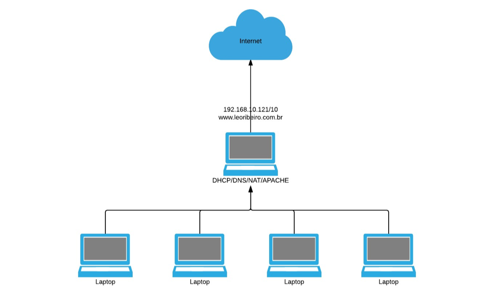
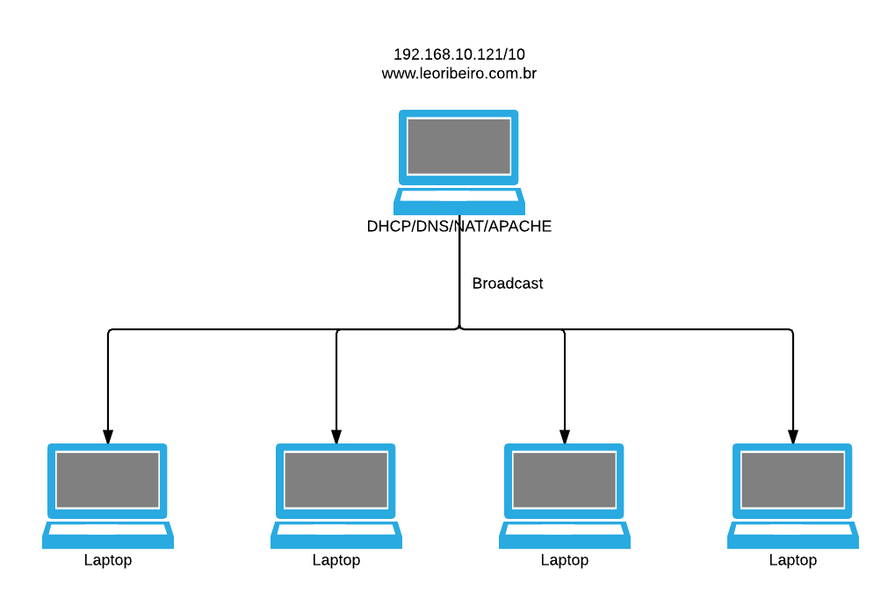

#Redes 3a VA

**Leonardo Ribeiro**

##Introdução
Essa documentação tem como objetivo dar informações relevantes e básicas referentes a comunfiguração de servidor Ubuntu Server com DHCP, NAT, DNS(cache e autoritativo), Apache e SSH.

##Topologia Física
Topologia Física - Formato estrela

##Topologia Lógica
Topologia lógica - Broadcast

##Acesso ao servidor - Ubuntu Server

Username: leoribeiro
Senha: nuirg9tf130721,

##Interfaces de rede

###eth0
IP estático 10.0.0.1
net mask 255.255.255.0
network 10.0.0.0
broadcast 10.0.0.255
dns-nameserver 10.0.0.1

###eth1
IP estático 192.168.10.121
net mask 255.255.255.0
gateway 192.168.10.253

##DHCP
Intervalo de IP: 10.0.0.40 a 10.0.0.50
Domain name: leoribeiro.com.br
Tempo padrão: 600ms
Tempo máximo 7200ms

##NAT
####Tabela de roteamento
POSTROUTING habiltado
MASQUERADE habiltado

##Interface de saída
eth1

##DNS-Cache
Porta 53
Permite que todos os clientes façam consulta

##DNS-Autoritativo
Porta 53
Permite que todos os clientes façam consulta

##SSH
Acesso permitido via SSH pela porta 22

##HTTP-APACHE

Disponível pelo IP: 192.168.10.121, porta 80
Disponível pelo domínio: leoribeiro.com.br
